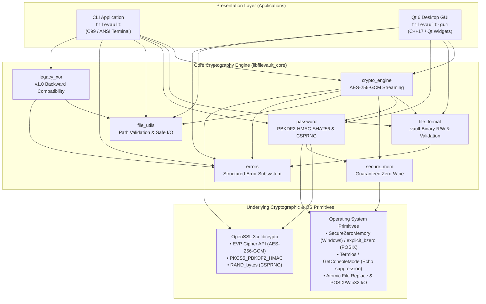
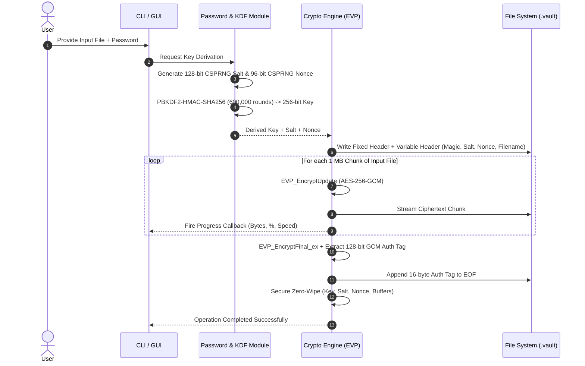
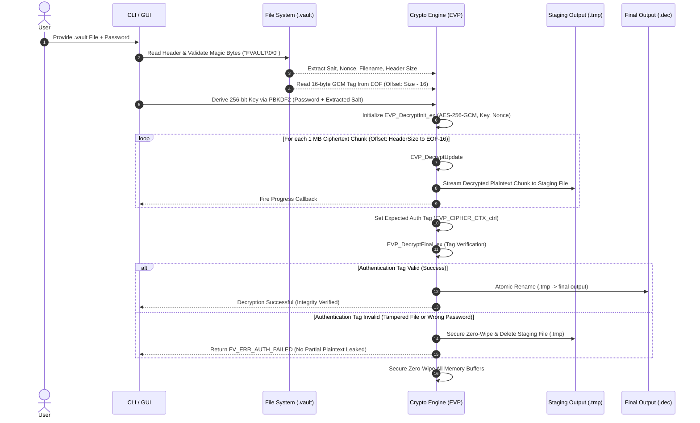
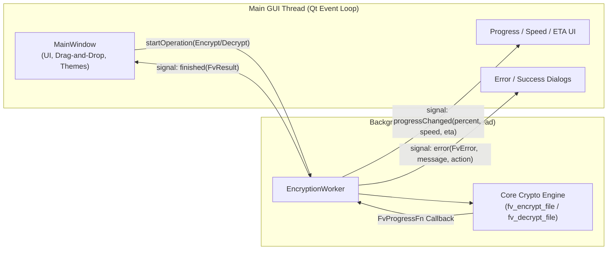

# FileVault v2.0 — Secure File Encryption Tool

A production-grade file encryption tool using **AES-256-GCM** authenticated encryption with **PBKDF2-HMAC-SHA256** key derivation. Built in C with a Qt 6 desktop GUI.

## Features

- **AES-256-GCM** authenticated encryption — industry standard
- **PBKDF2-HMAC-SHA256** key derivation (600,000 iterations)
- **Random salt and nonce** per encryption — same file encrypted twice produces different output
- **Tamper detection** — modified files are rejected
- **Streaming I/O** — supports files of any size without loading into RAM
- **Custom `.vault` container format** with versioned metadata
- **Legacy XOR mode** — backward compatible with v1.0 encrypted files
- **CLI + GUI** — command-line for automation, Qt desktop app for convenience
- **Cross-platform** — Windows, Linux, macOS

## Quick Start

### CLI

```bash
# Encrypt a file
filevault encrypt document.pdf

# Decrypt a file
filevault decrypt document.pdf.vault

# View encrypted file metadata
filevault info document.pdf.vault

# Decrypt legacy v1.0 XOR files
filevault legacy-xor-decrypt old_file.enc
```

### GUI

Launch `filevault-gui`, drag a file onto the window, enter a password, and click Encrypt or Decrypt.

## Security Model

- Encryption keys are **never stored** — derived from your password at runtime
- Passwords are **never saved** — wiped from memory immediately after use
- Wrong password produces **no output** — authentication tag verification prevents partial decryption
- Tampered files are **detected and rejected** — GCM authentication tag covers all ciphertext
- Each encryption uses a **unique random salt and nonce** — prevents ciphertext correlation

> **Warning:** If you forget your password, encrypted files **cannot be recovered**. There is no backdoor, no recovery key, and no password reset.

## System Architecture

FileVault v2.0 is engineered with a modular, layered architecture that strictly separates user interfaces, core cryptographic orchestration, safe platform operations, and external cryptographic primitives.

### 1. High-Level Layered Architecture



### 2. Component Decomposition & Responsibilities

| Subsystem / Module | Source Files | Primary Responsibilities |
|---|---|---|
| **Crypto Engine** | `core/src/crypto_engine.c`<br/>`core/include/filevault/crypto_engine.h` | Primary API for streaming AES-256-GCM authenticated encryption/decryption via OpenSSL EVP. Processes files in 1 MB chunk ring buffers for constant $O(1)$ RAM usage. Manages staging files (`.tmp`) and atomic file swaps upon tag verification. |
| **Container & Format** | `core/src/file_format.c`<br/>`core/include/filevault/file_format.h` | Serializes and deserializes the custom `.vault` binary container format. Handles little-endian integer encoding, magic byte verification (`FVAULT\0\0`), format versioning, metadata parsing, and payload boundary math. |
| **Password & KDF** | `core/src/password.c`<br/>`core/include/filevault/password.h` | Terminal echo suppression across Windows/POSIX, password validation/confirmation, CSPRNG generation (`RAND_bytes` for 128-bit salt and 96-bit nonce), and PBKDF2-HMAC-SHA256 key derivation (600,000 rounds). |
| **Secure Memory** | `core/src/secure_mem.c`<br/>`core/include/filevault/secure_mem.h` | Guaranteed zero-wipe sanitization (`SecureZeroMemory` on Windows, `explicit_bzero` on Linux, volatile fallback) for all key material, passphrases, salts, nonces, and cipher contexts to prevent compiler dead-code elimination. |
| **File Utilities** | `core/src/file_utils.c`<br/>`core/include/filevault/file_utils.h` | Path sanitization, directory traversal attack prevention (`..`), extension manipulation (`.vault`, `.dec`, `.enc`, `.key`), file existence/size validation, and safe line reading without buffer overflows. |
| **Legacy XOR Engine** | `core/src/legacy_xor.c`<br/>`core/include/filevault/legacy_xor.h` | Backward compatibility for v1.0 XOR files, automatic `.key` companion file discovery, and transparent decryption to facilitate migration to AES-256-GCM. |
| **Error Subsystem** | `core/src/errors.c`<br/>`core/include/filevault/errors.h` | Structured error enumerations (`FvError`) mapping to human-readable diagnostic messages and actionable remediation tips. |
| **CLI Application** | `cli/src/main.c`<br/>`cli/src/cli_commands.c`<br/>`cli/src/cli_progress.c` | Command-line interface with subcommands (`encrypt`, `decrypt`, `info`, `legacy-xor-*`), interactive password prompts, ANSI-colored terminal formatting, and dynamic streaming progress bar indicators. |
| **Qt 6 GUI** | `gui/src/MainWindow.cpp`<br/>`gui/src/EncryptionWorker.cpp`<br/>`gui/src/ThemeManager.cpp` | Modern desktop GUI featuring drag-and-drop file ingestion, asynchronous multi-threaded operations (`EncryptionWorker`), real-time throughput/ETA calculation, settings dialog, and customizable dark/light themes. |

### 3. Cryptographic Data Flow

#### Encryption Pipeline



#### Decryption & Tamper-Verification Pipeline



### 4. GUI Concurrency & Threading Model

To ensure a smooth, responsive 60 FPS user interface when processing multi-gigabyte files, FileVault GUI executes all encryption and decryption workloads inside a dedicated background worker thread:



### 5. Binary Container Specification (`.vault`)

The `.vault` container format is a self-contained, versioned, authenticated binary envelope designed for streaming I/O:

```
┌────────────────────────────────────────────────────────────────────────┐
│ FIXED HEADER (20 Bytes, Little-Endian)                                 │
├───────┬──────┬─────────────────────────────────────────────────────────┤
│ Off   │ Size │ Description                                             │
├───────┼──────┼─────────────────────────────────────────────────────────┤
│ 0x00  │ 8 B  │ Magic Identifier: ASCII "FVAULT\0\0" (0x465641554C540000)│
│ 0x08  │ 1 B  │ Format Version (0x01)                                   │
│ 0x09  │ 1 B  │ Cipher Algorithm ID (0x01 = AES-256-GCM)                │
│ 0x0A  │ 1 B  │ Key Derivation ID (0x01 = PBKDF2-HMAC-SHA256)           │
│ 0x0B  │ 1 B  │ Flags (0x00 reserved for future extensions)             │
│ 0x0C  │ 2 B  │ Salt Length uint16_t (LE, default 16 bytes)             │
│ 0x0E  │ 2 B  │ Nonce / IV Length uint16_t (LE, default 12 bytes)       │
│ 0x10  │ 2 B  │ Auth Tag Length uint16_t (LE, default 16 bytes)         │
│ 0x12  │ 2 B  │ Original Filename Length uint16_t (LE, N_f bytes)       │
├───────┴──────┴─────────────────────────────────────────────────────────┤
│ VARIABLE HEADER (N_s + N_n + N_f Bytes)                                │
├───────┬──────┬─────────────────────────────────────────────────────────┤
│ 0x14  │ N_s  │ Cryptographic Salt (16 bytes random)                   │
│ 0x24  │ N_n  │ AES-GCM Initialization Vector / Nonce (12 bytes random) │
│ ...   │ N_f  │ Original Filename (UTF-8, without path, up to 512 bytes)│
├───────┴──────┴─────────────────────────────────────────────────────────┤
│ PAYLOAD & TRAILER                                                      │
├───────┬──────┬─────────────────────────────────────────────────────────┤
│ H_end │ X B  │ Ciphertext Payload (AES-256-GCM encrypted stream)       │
│ EOF-16│ 16 B │ GCM Authentication Tag (128-bit cryptographic MAC)      │
└───────┴──────┴─────────────────────────────────────────────────────────┘
```

## Project Structure

```
FileVault/
├── core/           # C library — encryption engine
│   ├── include/    # Public headers
│   └── src/        # Implementation
├── cli/            # Command-line application
├── gui/            # Qt 6 desktop application
├── tests/          # Test suite
├── legacy/         # Original v1.0 code (reference)
├── docs/           # Additional documentation
└── examples/       # Sample test files
```

## Build Instructions

See [BUILD.md](BUILD.md) for complete build instructions for all platforms.

### Quick Build (Linux)

```bash
sudo apt install libssl-dev cmake build-essential
cmake -B build -DBUILD_TESTS=ON
cmake --build build
cd build && ctest --output-on-failure
```

## CLI Commands

| Command | Description |
|---|---|
| `filevault encrypt <file>` | Encrypt using AES-256-GCM |
| `filevault decrypt <file.vault>` | Decrypt a .vault file |
| `filevault info <file.vault>` | Show file metadata |
| `filevault legacy-xor-encrypt <file>` | Encrypt using legacy XOR (insecure) |
| `filevault legacy-xor-decrypt <file.enc>` | Decrypt legacy .enc files |
| `filevault help` | Show usage information |
| `filevault version` | Show version |

## Technical Details

| Parameter | Value |
|---|---|
| Encryption | AES-256-GCM (OpenSSL EVP) |
| Key Derivation | PBKDF2-HMAC-SHA256 |
| PBKDF2 Iterations | 600,000 |
| Salt Size | 16 bytes (128-bit) |
| Nonce Size | 12 bytes (96-bit) |
| Auth Tag Size | 16 bytes (128-bit) |
| Key Size | 32 bytes (256-bit) |
| Chunk Size | 1 MB (streaming) |

## License

MIT License — see [LICENSE](LICENSE) for details.

## Acknowledgments

- [OpenSSL](https://www.openssl.org/) for cryptographic primitives
- [Qt](https://www.qt.io/) for the GUI framework
- Original File Encryption Tool by the project author
