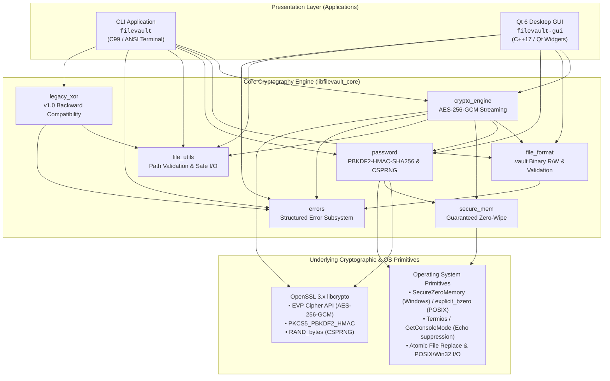
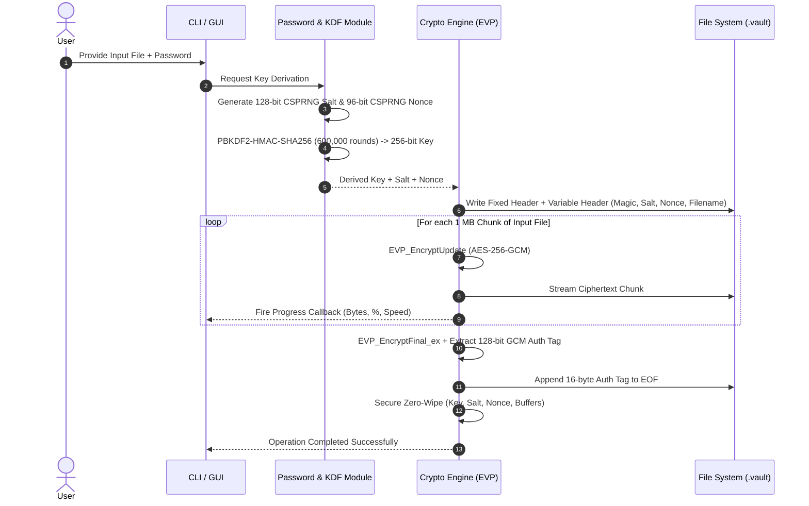
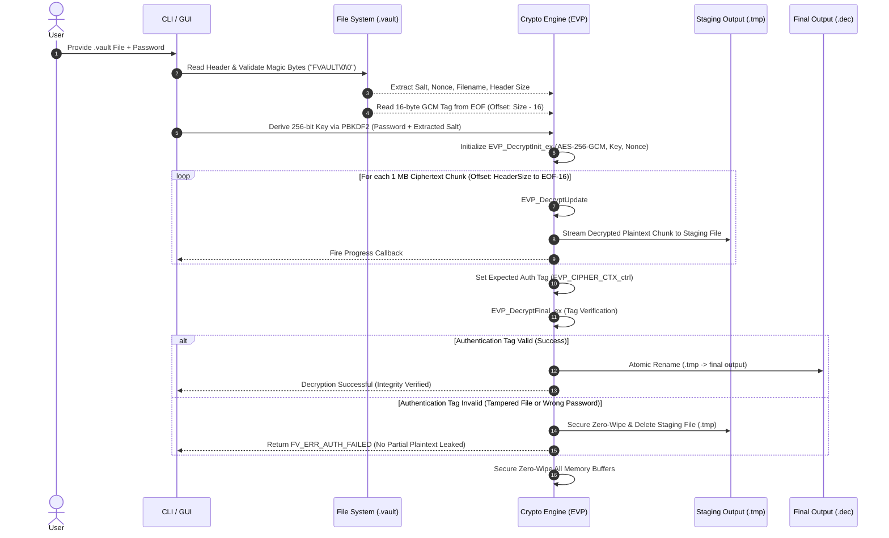
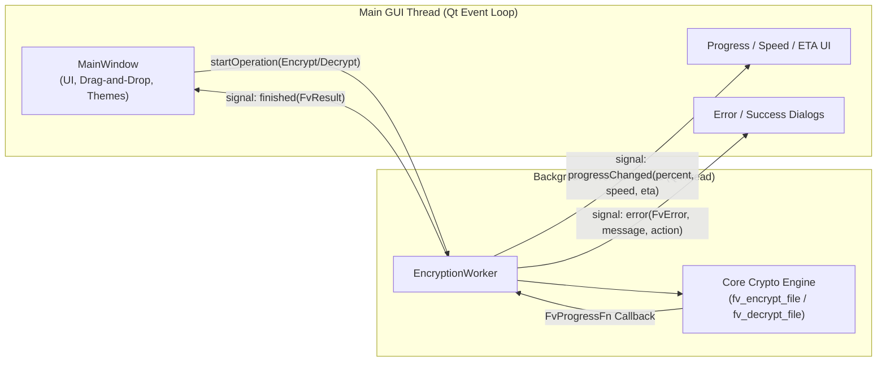

# FileVault — Secure File Encryption Tool

A production-grade, high-performance file encryption suite featuring **AES-256-GCM** authenticated encryption, **PBKDF2-HMAC-SHA256** key derivation, a streaming $O(1)$ memory architecture, a cross-platform C core library, a dedicated CLI, and a modern Qt 6 GUI.

---

## Table of Contents

- [Features](#features)
- [System Architecture](#system-architecture)
  - [1. High-Level Layered Architecture](#1-high-level-layered-architecture)
  - [2. Component Decomposition & Responsibilities](#2-component-decomposition--responsibilities)
  - [3. Cryptographic Data Flow](#3-cryptographic-data-flow)
  - [4. GUI Concurrency & Threading Model](#4-gui-concurrency--threading-model)
  - [5. Binary Container Specification (`.vault`)](#5-binary-container-specification-vault)
- [Security & Threat Model](#security--threat-model)
- [Quick Start](#quick-start)
  - [Command Line Interface (CLI)](#command-line-interface-cli)
  - [Desktop GUI (Qt 6)](#desktop-gui-qt-6)
- [Project Structure](#project-structure)
- [Build Instructions](#build-instructions)
- [CLI Reference](#cli-reference)
- [Technical Specifications](#technical-specifications)
- [License & Acknowledgments](#license--acknowledgments)

---

## Features

- **AES-256-GCM Authenticated Encryption**: High-security Galois/Counter Mode providing both confidentiality and cryptographic integrity verification.
- **Robust Key Derivation (PBKDF2-HMAC-SHA256)**: 600,000 iterations (OWASP recommended standard) resisting brute-force and dictionary attacks.
- **Unique Salt & Nonce per Operation**: 128-bit CSPRNG salt and 96-bit CSPRNG nonce prevent ciphertext correlation and rainbow table attacks.
- **Active Tamper Detection**: Instant rejection of modified, corrupted, or forged ciphertext with zero plaintext leakage.
- **Constant $O(1)$ RAM Streaming Engine**: Processes multi-gigabyte files via 1 MB chunk ring buffers without high memory overhead.
- **Atomic File Operations**: Decrypts to secure staging files (`.tmp`) and commits via atomic rename only upon verified authentication.
- **Custom `.vault` Binary Container**: Self-contained metadata format with versioning and little-endian encoding.
- **Legacy v1.0 XOR Compatibility**: Seamlessly decrypt and migrate files encrypted with older tool versions.
- **Dual Interfaces**: High-speed command-line interface for scripting/automation, and a sleek Qt 6 desktop application with dark/light themes.
- **Cross-Platform**: Native builds on Windows, Linux, and macOS.

---

## System Architecture

FileVault is architected with clear separation of concerns across a presentation layer, a pure-C cryptographic engine, low-level platform utilities, and industry-standard cryptographic primitives.

### 1. High-Level Layered Architecture



### 2. Component Decomposition & Responsibilities

| Subsystem / Module | Source Files | Primary Responsibilities |
|---|---|---|
| **Crypto Engine** | `FileVault/core/src/crypto_engine.c`<br/>`FileVault/core/include/filevault/crypto_engine.h` | Primary API for streaming AES-256-GCM authenticated encryption and decryption via OpenSSL EVP. Processes files in 1 MB chunk ring buffers for constant $O(1)$ RAM usage. Manages staging files (`.tmp`) and atomic file swaps upon tag verification. |
| **Container & Format** | `FileVault/core/src/file_format.c`<br/>`FileVault/core/include/filevault/file_format.h` | Serializes and deserializes the custom `.vault` binary container format. Handles little-endian integer encoding, magic byte verification (`FVAULT\0\0`), format versioning, metadata parsing, and payload boundary math. |
| **Password & KDF** | `FileVault/core/src/password.c`<br/>`FileVault/core/include/filevault/password.h` | Terminal echo suppression across Windows and POSIX, password validation/confirmation, CSPRNG generation (`RAND_bytes` for 128-bit salt and 96-bit nonce), and PBKDF2-HMAC-SHA256 key derivation (600,000 rounds). |
| **Secure Memory** | `FileVault/core/src/secure_mem.c`<br/>`FileVault/core/include/filevault/secure_mem.h` | Guaranteed zero-wipe sanitization (`SecureZeroMemory` on Windows, `explicit_bzero` on Linux, volatile fallback) for all key material, passphrases, salts, nonces, and cipher contexts to prevent compiler dead-code elimination. |
| **File Utilities** | `FileVault/core/src/file_utils.c`<br/>`FileVault/core/include/filevault/file_utils.h` | Path sanitization, directory traversal attack prevention (`..`), extension manipulation (`.vault`, `.dec`, `.enc`, `.key`), file existence/size validation, and safe line reading without buffer overflows. |
| **Legacy XOR Engine** | `FileVault/core/src/legacy_xor.c`<br/>`FileVault/core/include/filevault/legacy_xor.h` | Backward compatibility for v1.0 XOR files, automatic `.key` companion file discovery, and transparent decryption to facilitate migration to AES-256-GCM. |
| **Error Subsystem** | `FileVault/core/src/errors.c`<br/>`FileVault/core/include/filevault/errors.h` | Structured error enumerations (`FvError`) mapping to human-readable diagnostic messages and actionable remediation tips. |
| **CLI Application** | `FileVault/cli/src/main.c`<br/>`FileVault/cli/src/cli_commands.c`<br/>`FileVault/cli/src/cli_progress.c` | Command-line interface with subcommands (`encrypt`, `decrypt`, `info`, `legacy-xor-*`), interactive password prompts, ANSI-colored terminal formatting, and dynamic streaming progress bar indicators. |
| **Qt 6 GUI** | `FileVault/gui/src/MainWindow.cpp`<br/>`FileVault/gui/src/EncryptionWorker.cpp`<br/>`FileVault/gui/src/ThemeManager.cpp` | Modern desktop GUI featuring drag-and-drop file ingestion, asynchronous multi-threaded operations (`EncryptionWorker`), real-time throughput/ETA calculation, settings dialog, and customizable dark/light themes. |

---

### 3. Cryptographic Data Flow

#### Encryption Pipeline



#### Decryption & Tamper-Verification Pipeline



---

### 4. GUI Concurrency & Threading Model

To guarantee a stutter-free 60 FPS user interface while encrypting multi-gigabyte files, FileVault GUI delegates all cryptographic operations to an asynchronous background worker thread:



---

### 5. Binary Container Specification (`.vault`)

The `.vault` binary format stores encrypted payload data alongside all non-secret metadata necessary for decryption:

```
┌────────────────────────────────────────────────────────────────────────┐
│ FIXED HEADER (20 Bytes, Little-Endian)                                 │
├───────┬──────┬─────────────────────────────────────────────────────────┤
│ Off   │ Size │ Description                                             │
├───────┼──────┼─────────────────────────────────────────────────────────┤
│ 0x00  │ 8 B  │ Magic Identifier: ASCII "FVAULT\0\0" (0x465641554C540000)│
│ 0x08  │ 1 B  │ Format Version (0x01)                                   │
│ 0x09  │ 1 B  │ Cipher Algorithm ID (0x01 = AES-256-GCM)                │
│ 0x0A  │ 1 B  │ Key Derivation ID (0x01 = PBKDF2-HMAC-SHA256)           │
│ 0x0B  │ 1 B  │ Flags (0x00 reserved for future extensions)             │
│ 0x0C  │ 2 B  │ Salt Length uint16_t (LE, default 16 bytes)             │
│ 0x0E  │ 2 B  │ Nonce / IV Length uint16_t (LE, default 12 bytes)       │
│ 0x10  │ 2 B  │ Auth Tag Length uint16_t (LE, default 16 bytes)         │
│ 0x12  │ 2 B  │ Original Filename Length uint16_t (LE, N_f bytes)       │
├───────┴──────┴─────────────────────────────────────────────────────────┤
│ VARIABLE HEADER (N_s + N_n + N_f Bytes)                                │
├───────┬──────┬─────────────────────────────────────────────────────────┤
│ 0x14  │ N_s  │ Cryptographic Salt (16 bytes random)                   │
│ 0x24  │ N_n  │ AES-GCM Initialization Vector / Nonce (12 bytes random) │
│ ...   │ N_f  │ Original Filename (UTF-8, without path, up to 512 bytes)│
├───────┴──────┴─────────────────────────────────────────────────────────┤
│ PAYLOAD & TRAILER                                                      │
├───────┬──────┬─────────────────────────────────────────────────────────┤
│ H_end │ X B  │ Ciphertext Payload (AES-256-GCM encrypted stream)       │
│ EOF-16│ 16 B │ GCM Authentication Tag (128-bit cryptographic MAC)      │
└───────┴──────┴─────────────────────────────────────────────────────────┘
```

---

## Security & Threat Model

- **Zero Key Persistence**: Symmetric encryption keys are dynamically derived in memory at runtime and never persisted to disk.
- **Guaranteed Memory Sanitization**: All buffers holding passwords, salts, nonces, and keys are scrubbed immediately using platform-specific non-optimizing zero-fill routines.
- **AEAD Integrity Assurance**: The 128-bit authentication tag covers the entire ciphertext stream, rendering chosen-ciphertext and bit-flipping attacks computationally infeasible.
- **Fail-Safe Decryption**: If authentication tag validation fails, all temporary output buffers are immediately zeroed and removed, guaranteeing that no partial plaintext is ever leaked.
- **Unique Per-File Nonces**: Nonce collisions are prevented by generating fresh random 96-bit initialization vectors for every encryption invocation.

> [!WARNING]
> If you lose or forget your encryption password, data recovery is mathematically impossible. FileVault does not contain backdoors, master keys, or recovery mechanisms.

---

## Quick Start

### Command Line Interface (CLI)

```bash
# Encrypt a file using AES-256-GCM
filevault encrypt confidential.pdf

# Decrypt a .vault container
filevault decrypt confidential.pdf.vault

# Inspect container metadata without decrypting
filevault info confidential.pdf.vault

# Decrypt legacy v1.0 XOR files
filevault legacy-xor-decrypt archive.txt.enc
```

### Desktop GUI (Qt 6)

Launch `filevault-gui`, drag-and-drop any target file into the drop zone, enter your passphrase, and select **Encrypt** or **Decrypt**. Real-time throughput, percentage progress, and ETA are displayed dynamically.

---

## Project Structure

```
File-Encryption-Tool/
├── FileVault/                  # FileVault v2.0 Production Engine
│   ├── CMakeLists.txt          # Root CMake build configuration
│   ├── core/                   # C Cryptographic Core Library
│   │   ├── include/filevault/  # Public API headers
│   │   │   ├── crypto_engine.h # AES-256-GCM streaming API
│   │   │   ├── errors.h        # Error codes and messages
│   │   │   ├── file_format.h   # .vault binary format parser
│   │   │   ├── file_utils.h    # Path and safe I/O utilities
│   │   │   ├── legacy_xor.h    # v1.0 XOR compatibility
│   │   │   ├── password.h      # PBKDF2 & echo-off input
│   │   │   ├── secure_mem.h    # Memory zeroing utilities
│   │   │   └── version.h       # Version definitions
│   │   └── src/                # Core C implementations
│   ├── cli/                    # Command-Line Application (C99)
│   │   └── src/                # CLI parser, progress bar & handlers
│   ├── gui/                    # Qt 6 Desktop Application (C++17)
│   │   └── src/                # MainWindow, Worker, ThemeManager
│   ├── tests/                  # Automated CTest Suite
│   └── examples/               # Test sample files
├── docs/                       # Legacy v1.0 source and documentation
└── files/                      # Sample files for legacy tests
```

---

## Build Instructions

### Prerequisites

- **CMake** 3.16 or higher
- **C/C++ Compiler** (GCC 9+, Clang 10+, or MSVC 2019+)
- **OpenSSL** 3.0+ development libraries
- **Qt 6** (optional, required only for GUI builds: `Widgets` component)

### Building on Linux / macOS

```bash
# Install dependencies (Ubuntu/Debian)
sudo apt update && sudo apt install -y libssl-dev qt6-base-dev cmake build-essential

# Configure and compile
cd FileVault
cmake -B build -DCMAKE_BUILD_TYPE=Release -DBUILD_GUI=ON -DBUILD_TESTS=ON
cmake --build build -j$(nproc)

# Run test suite
cd build && ctest --output-on-failure
```

### Building on Windows (MSVC or MinGW)

```powershell
cd FileVault
cmake -B build -DCMAKE_BUILD_TYPE=Release -DBUILD_TESTS=ON
cmake --build build --config Release

# Run automated tests
cd build
ctest -C Release --output-on-failure
```

---

## CLI Reference

| Command | Arguments | Description |
|---|---|---|
| `encrypt` | `<file> [-o <out>] [--force]` | Encrypts a file using AES-256-GCM |
| `decrypt` | `<file.vault> [-o <out>] [--force]` | Decrypts a `.vault` container with integrity verification |
| `info` | `<file.vault>` | Displays header metadata (version, cipher, KDF, salt, nonce, filename) |
| `legacy-xor-encrypt` | `<file> [-o <out>]` | Encrypts a file using legacy v1.0 XOR mode (for compatibility testing) |
| `legacy-xor-decrypt` | `<file.enc> [--key-file <key>]` | Decrypts legacy v1.0 `.enc` files |
| `help` | — | Displays command usage and available options |
| `version` | — | Displays FileVault version and build configuration |

---

## Technical Specifications

| Parameter | Specification | Standard / Reference |
|---|---|---|
| **Cipher Algorithm** | AES-256 in Galois/Counter Mode (GCM) | NIST SP 800-38D |
| **Key Derivation Function** | PBKDF2-HMAC-SHA256 | RFC 8018 / PKCS #5 v2.1 |
| **PBKDF2 Iteration Count** | 600,000 rounds | OWASP Password Storage Guidelines (2024) |
| **Key Length** | 256 bits (32 bytes) | FIPS 197 |
| **Salt Size** | 128 bits (16 bytes) | Cryptographically Secure Random (`RAND_bytes`) |
| **Initialization Vector (Nonce)** | 96 bits (12 bytes) | NIST recommended size for GCM mode |
| **Authentication Tag** | 128 bits (16 bytes) | Full GCM MAC tag |
| **Streaming Buffer Size** | 1 MB (1,048,576 bytes) | Chunked streaming ring buffer ($O(1)$ RAM) |
| **Container Magic Bytes** | `FVAULT\0\0` (`0x465641554C540000`) | 8-byte container identifier |
| **Endianness** | Little-Endian | Multi-byte header fields |

---

## License & Acknowledgments

Distributed under the **MIT License**. See [LICENSE](FileVault/LICENSE) for full details.

- Cryptographic primitives provided by [OpenSSL](https://www.openssl.org/).
- Desktop user interface built with the [Qt Framework](https://www.qt.io/).
